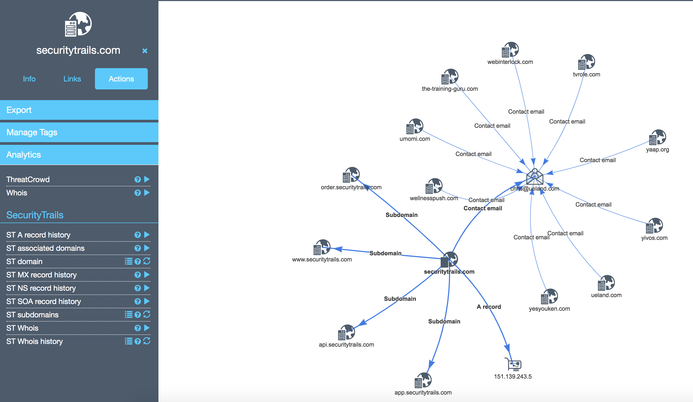

# yeti-securitytrails

[Yeti](https://github.com/yeti-platform/yeti) analytics plugins for [SecurityTrails](https://securitytrails.com/).

## Installation

```bash
git clone https://github.com/ninoseki/yeti-securitytrails
ln -s ./yeti-securitytrails/securitytrails.py /opt/yeti/plugins/analytics/private/
```

## Example



## Supported APIs

- [Official API references](https://docs.securitytrails.com/v1.0/reference)

| Name                                 | URI                            | Action                        | Acts on  |
|--------------------------------------|--------------------------------|-------------------------------|----------|
| Get Domain                           | /domain/{hostname}             | ST domain                     | Hostname |
| List Subdomains                      | /domain/{hostname}/subdomains  | ST subdomains                 | Hostname |
| Find associated domains              | /domain/{hostname}/associated  | ST associated domains         | Hostname |
| Get WHOIS                            | /domain/{hostname}/whois       | ST Whois                      | Hostname |
| DNS history                          | /history/{hostname}/dns/{type} | ST A/NS/SOA/MX record history | Hostname |
| WHOIS history                        | /history/{hostname}/whois      | ST Whois history              | Hostname |
| Domain search (reverse IP lookup)    | /domains/list                  | ST reverse IP                 | Ip       |
| Domain search (reverse Whois lookup) | /domains/list                  | ST reverse Whois              | Email    |
